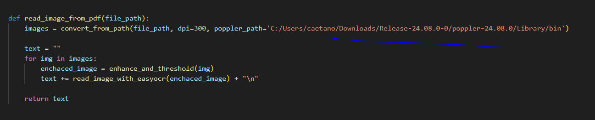

## Instalation guide

first install git: 
https://git-scm.com/downloads

install python 3.9.12:
https://www.python.org/downloads/release/python-3912/

install visual studio as well as it required when running cuda:
https://visualstudio.microsoft.com/pt-br/downloads/

install cuda:
https://developer.nvidia.com/cuda-downloads?target_os=Windows

git clone https://github.com/caetanovidal/challenge-api-fast-api

pip install -r requirements.txt

create an file named ".env"

add in ther you gpt KEY

OPENAI_API_KEY = "your-gpt-key-goes-here"

install poppler and replace poppler_path:

run:
uvicorn app:app --reload 

you may need to run this as well if you are facing connecting problems

"C:\Users\caetano\AppData\Local\Programs\Python\Python39\python.exe" -m pip install --upgrade certifi